### EXERCISE 3.01

The requirement for this exercise was todeploy the Ping-pong application (backed by Postgres) into a GKE cluster and expose it directly via a Service of type LoadBalancer

First I created a new GKE cluster named pingpong-cluster in zone us-central1-a with one node:

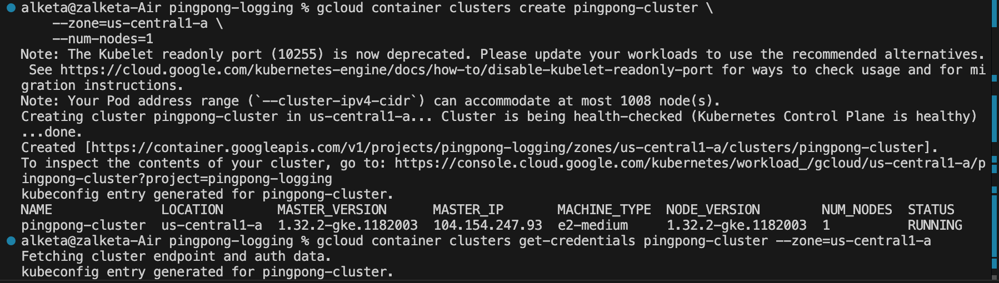

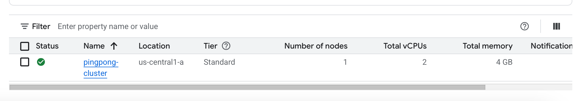

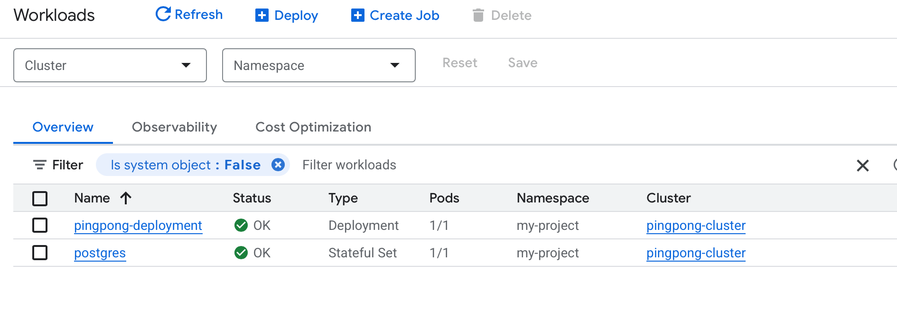

Exposed the Ping-pong app using a Service of type LoadBalancer named pingpong-lb.Then I retrieved the external IP from the LoadBalancer Service and used it to test my application:

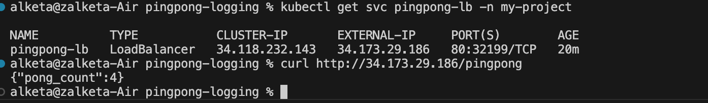

### EXERCISE3.02

I deployed on a GKE cluster with the HTTP Load Balancing addon enabled

Each Flask app was extended with a root (/) route returning HTTP 200 (“OK”) so that GCE Ingress L7 health probes mark the backends healthy
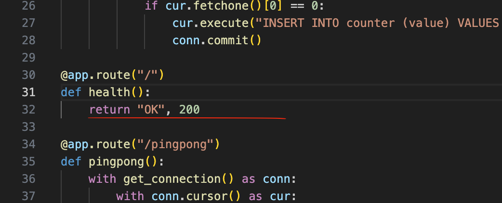

I useda single Ingress resource, annotated with kubernetes.io/ingress.class: "gce", to map /pingpong to the Ping-pong Service (port 5000) and /status to the Log-output Service and used the adress of it in my tests.

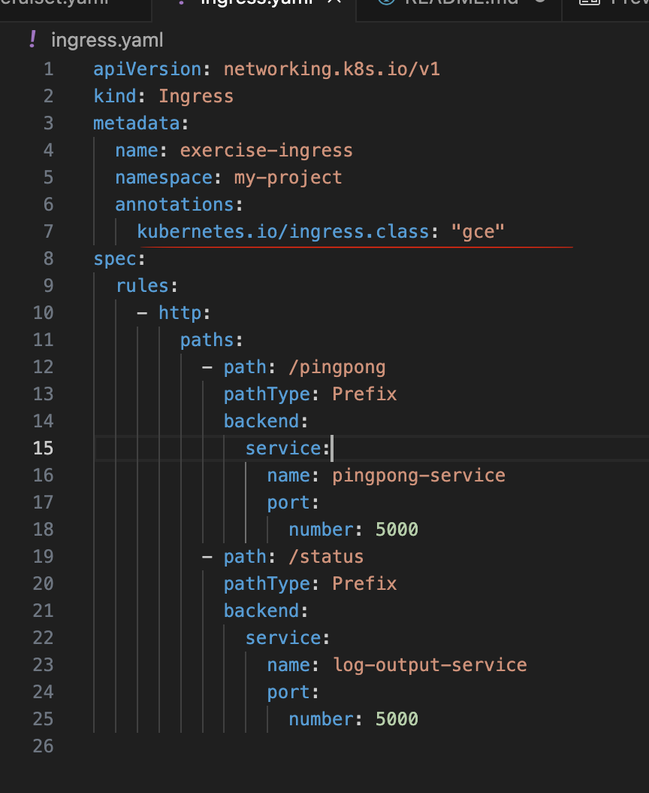

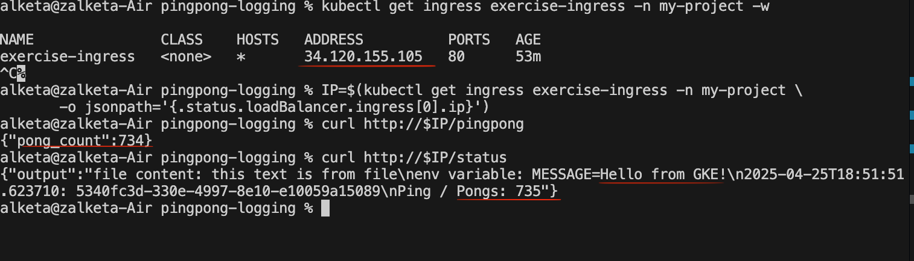

I tested it with curl in terminal

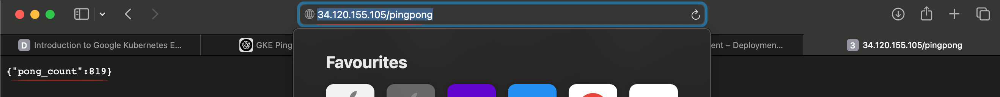

Also in the browser:

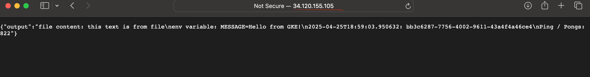

Here we can see this in my google cloud platform: 

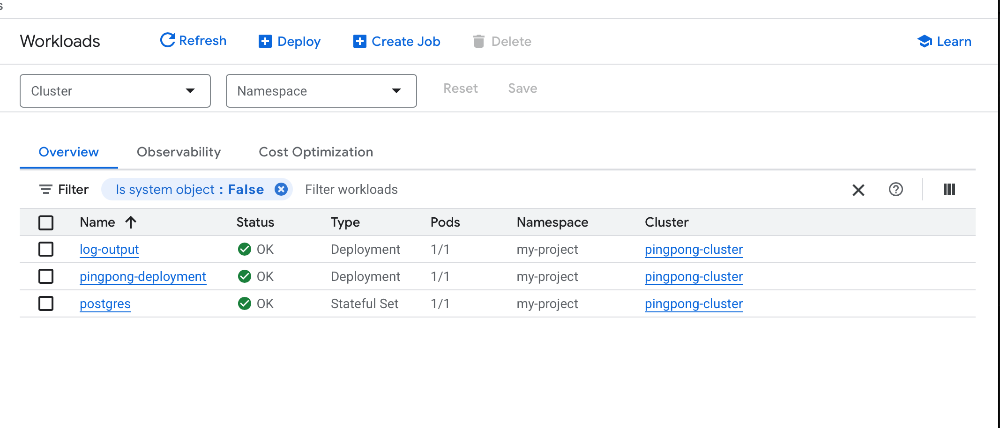

If we go inside pingpong deployment 
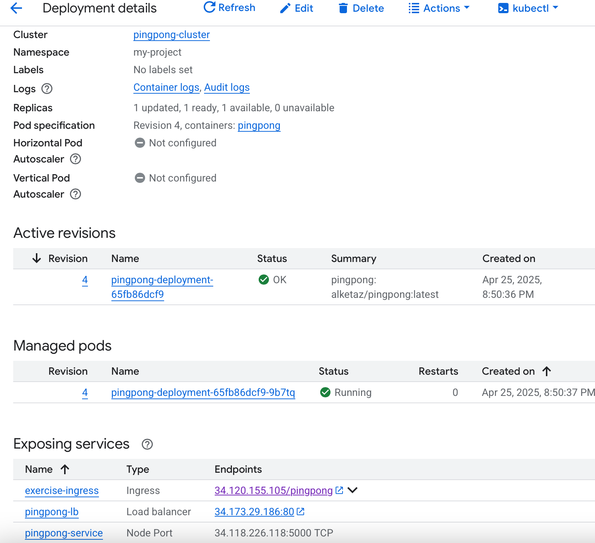

And in log-output
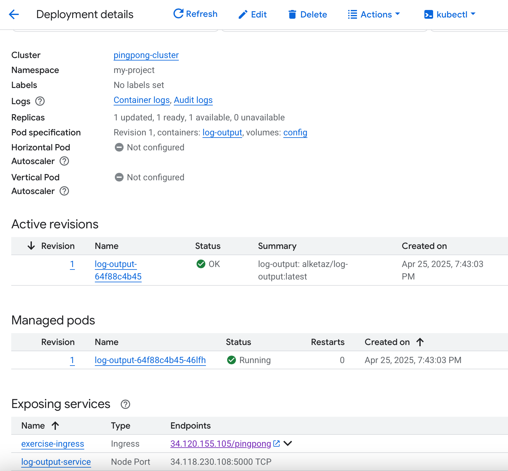

### EXERCISE 3.03

I started with 