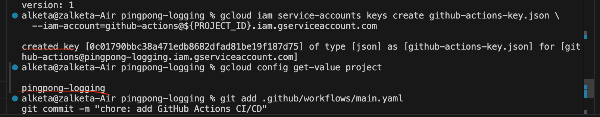

### EXERCISE 3.01

The requirement for this exercise was todeploy the Ping-pong application (backed by Postgres) into a GKE cluster and expose it directly via a Service of type LoadBalancer

First I created a new GKE cluster named pingpong-cluster in zone us-central1-a with one node:

Exposed the Ping-pong app using a Service of type LoadBalancer named pingpong-lb.Then I retrieved the external IP from the LoadBalancer Service and used it to test my application:

### EXERCISE3.02

I deployed on a GKE cluster with the HTTP Load Balancing addon enabled

Each Flask app was extended with a root (/) route returning HTTP 200 (“OK”) so that GCE Ingress L7 health probes mark the backends healthy

I useda single Ingress resource, annotated with kubernetes.io/ingress.class: "gce", to map /pingpong to the Ping-pong Service (port 5000) and /status to the Log-output Service and used the adress of it in my tests.

I tested it with curl in terminal

Also in the browser:

Here we can see this in my google cloud platform: 

If we go inside pingpong deployment 

And in log-output

### EXERCISE 3.03

Objective was to:

Set up automatic deployment for the pingpong-logging project, ensuring
Docker images are built and pushed automatically.
Application is deployed to GKE (Google Kubernetes Engine) via GitHub Actions.
Services are exposed through an Ingress with a working domain (todo.local)

I started with:

1. GitHub Actions CI/CD Setup
Created a GitHub Actions workflow (.github/workflows/deploy.yml).

Configured it so that on every push, GitHub will:
Authenticate to Google Cloud (GCP) using a service account key (GKE_SA_KEY).

Build the pingpong Docker image and tag it.
Build the log-output Docker image and tag it.
Push both images to Google Artifact Registry.

Deploy the Kubernetes manifests using kubectl apply.
Update the running Kubernetes deployments to use the new images.
Wait for the new deployments to become available.

2. Docker Images
The pingpong app and log-output app each have a Dockerfile.
Docker images are tagged with a combination of branch name and commit SHA for versioning.
Example tag:

us-central1-docker.pkg.dev/pingpong-logging/pingpong-logging/pingpong:main-abc123

3. Kubernetes Configuration
Deployments were written for pingpong and log-output apps.
Used Kubernetes best practices:
Readiness probe (/) to check that services are ready.
Liveness probe to restart pods if they become unhealthy.
Used a Recreate strategy for log-output to avoid Persistent Volume Claim (PVC) conflicts.
Services expose the pods inside the cluster.
Ingress routes external HTTP traffic to the correct service.
4. Ingress Setup
Ingress Class: nginx
Rules configured:
Requests to /pingpong go to pingpong-service.
Requests to /status go to log-output-service.
Hostname used: todo.local
Updated local /etc/hosts to map todo.local to the Minikube IP.
Example /etc/hosts line:

192.168.58.2   todo.local
5. Testing
Verified that after code push:
Workflow builds, pushes images, and deploys without errors.

Tested the services:
curl http://todo.local/pingpong
curl http://todo.local/status
Verified that the services respond correctly:
/pingpong returns the current ping-pong counter.
/status returns the latest log output.
6. Fixes and Improvements Made
Increased rollout timeout to 300s to avoid "exceeded progress deadline" errors.
Added / path (/health) in Flask app to support readiness probes properly.
Used kustomize build . | kubectl apply -f - instead of applying YAML files one-by-one.
Updated GitHub Actions to wait for deployments to fully roll out before marking the workflow as success.

